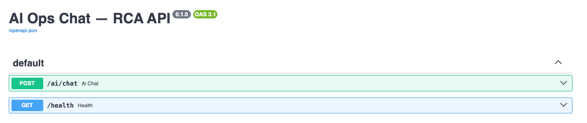
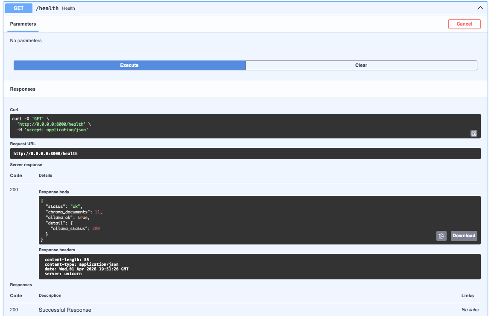
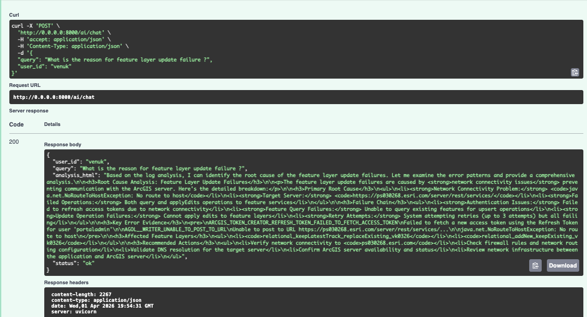

# ai-ops-chat

Agentic **Root Cause Analysis (RCA)** over structured application logs: watch a folder, parse pipe-delimited lines, embed English log text with **Ollama**, store vectors in **ChromaDB**, and answer questions through a **Strands** agent on **Amazon Bedrock** via a **FastAPI** `POST /ai/chat` endpoint.

## Prerequisites

- Python 3.10+
- [Ollama](https://ollama.com/) running locally with an embedding model, e.g. `ollama pull nomic-embed-text`
- AWS credentials with permission to invoke your Bedrock model (`bedrock:InvokeModel`), and the model enabled in your account/region
- Optional: `.env` — copy from `.env.example`

## Install

```bash
python -m venv .venv
source .venv/bin/activate   # Windows: .venv\Scripts\activate
pip install -e ".[dev]"
```

## Run

```bash
# From repo root with venv activated
uvicorn ai_ops_chat.main:app --host 0.0.0.0 --port 8000
```

- Drop `.log`, `.txt`, or extensionless log files under `LOG_WATCH_DIR` (default `./logs_inbox`), including nested subfolders when `LOG_WATCH_RECURSIVE` is `true` (the default). Set `LOG_WATCH_RECURSIVE=false` to watch only the top-level directory. Files are scanned using the `:::LF:::` record delimiter (not line breaks alone). Incremental state lives in `CHROMA_PERSIST_DIR/ingest_state.json` (if you previously indexed with an older newline-based scheme, delete that file and re-ingest).
- `GET /health` — Chroma document count and Ollama reachability.
- `POST /ai/chat` — JSON body `{"query": "...", "user_id": "..."}`; response includes `analysis_html` (agent summary in HTML).

### Log line format

Logical **records** end at the delimiter `:::LF:::`. The first line of a record is pipe-delimited (10 fields):

`field0|field1|...|field8|message`

Examples use `field0` like `[ERROR]` and a structured `message` segment with bracketed metadata and plain English text before `:::LF:::`. Optional text after `:::LF:::` (e.g. `:::LF::::` plus a colon and JVM stack frames) is kept in the **same record** until the next line that begins a new log with `[LEVEL]|`. Chroma documents embed the extracted English line plus any stack trace for search.

## Configuration

Environment variables (see [`.env.example`](.env.example)) include `LOG_WATCH_DIR`, `LOG_WATCH_RECURSIVE`, `CHROMA_PERSIST_DIR`, `OLLAMA_BASE_URL`, `OLLAMA_EMBED_MODEL`, `AWS_REGION`, `BEDROCK_MODEL_ID`, and `AGENT_NAME`.

**Important:** Use the same `OLLAMA_EMBED_MODEL` for all ingestion after you start indexing; changing the model without re-ingesting will hurt retrieval quality.

If startup logs show `httpx.ReadTimeout` against Ollama, ensure `ollama serve` is running, run `ollama pull <your embed model>`, and raise `OLLAMA_EMBED_TIMEOUT_SECONDS` (default 600) if the first embed after restart loads the model slowly. Hidden files like `.DS_Store` are not ingested. A failed initial scan is logged but the API still starts so you can fix Ollama and add or touch log files afterward.

## Tests

```bash
pytest
```

## Swagger endpoints

With the server running, interactive docs are at [http://127.0.0.1:8000/docs](http://127.0.0.1:8000/docs) (Swagger UI) and [http://127.0.0.1:8000/redoc](http://127.0.0.1:8000/redoc) (ReDoc).







## Root Cause Analysis (HMTL)

Query outpurt report,


